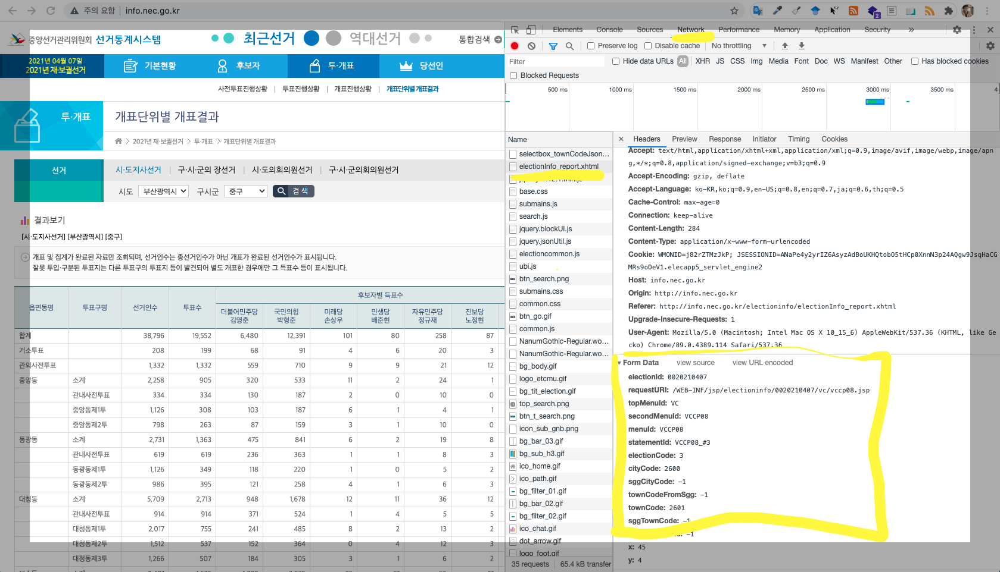

```{r setup, include=FALSE}
knitr::opts_chunk$set(echo = TRUE)

library(tidyverse)
library(rvest)
library(httr)

```

# 선거구 {#electrics}

<https://namu.wiki/w/제21대 국회의원 선거/지역구 국회의원/서울특별시> 나무위키에 나온 서울특별시 선거구를 활용하여 서울시 구별 선거구를 특정한다. 서울시는 25개 구로 구성된다. 중구, 성동구가 갑을로 합쳐져 있어 아래 24개 선거구로 구분된다.

## 구별 선거구 {#gu-electrics}

```{r seoul-precinct-gu}

precint_raw <- tribble(~"선거구",
                        "종로구",
                        "중구·성동구 갑/을",
                        "용산구",
                        "광진구 갑/을",
                        "동대문구 갑/을",
                        "중랑구 갑/을",
                        "성북구 갑/을",
                        "강북구 갑/을",
                        "도봉구 갑/을",
                        "노원구 갑/을/병",
                        "은평구 갑/을",
                        "서대문구 갑/을",
                        "마포구 갑/을",
                        "양천구 갑/을",
                        "강서구 갑/을/병",
                        "구로구 갑/을",
                        "금천구",
                        "영등포구 갑/을",
                        "동작구 갑/을",
                        "관악구 갑/을",
                        "서초구 갑/을",
                        "강남구 갑/을/병",
                        "송파구 갑/을/병",
                        "강동구 갑/을")

precint_tbl <- precint_raw %>% 
  mutate(선거구_분리 = str_split(선거구, "/")) %>% 
  mutate(선거구수    = map_int(선거구_분리, length)) %>% 
  arrange(desc(선거구수))

precint_tbl
```


## 서울 선거구 지도 {#gu-electrics}

오마이뉴스에서 제작학 "2020. 4. 15. 21대 국회의원 총선거 선거구 지도"를 선거구 지도로 사용한다.

- <https://github.com/OhmyNews/2020_21_elec_map> 

```{r seoul-precinct-map-csv}
precint_map_csv <- read_csv("data/2020_21_elec_map-master/21_SGG.csv")
precint_map_csv
```

```{r precinct-map-sf}
library(sf)

precinct_sf <- sf::st_read("data/2020_21_elec_map-master/2020_21_elec_253_simple.json")

seoul_precinct_sf <- precinct_sf %>% 
  filter(SGG_1 == "서울") %>% 
  mutate(선거구 = str_remove(SGG_2, "서울특별시 "))
```


```{r seoul-precinct-map-sf}
library(ggrepel)

seoul_precinct_sf %>% 
  ggplot() +
    geom_sf(aes(fill=선거구)) +
    # geom_sf_label(aes(label = 선거구), family= "NanumGothic") +
    theme_void(base_family = "NanumGothic") +
    theme(legend.position = "none") +
    ggrepel::geom_label_repel(
      aes(label = 선거구, geometry = geometry),
      stat = "sf_coordinates",
      min.segment.length = 0, family= "NanumGothic",
      size = 3) +
    scale_fill_viridis_d()
```


# 서울시장

[선관위 웹사이트](http://info.nec.go.kr/) 에서 제21대 2019년 국회의원선거 개표결과를 공지하여 데이터를 제공하고 있다.

- "결과보기": http://info.nec.go.kr/electioninfo/electionInfo_report.xhtml
- "결과보기"에 전달되는 주요 매개변수
    - `electionId` 
    - ...



## 국회의원선거 - 종로구 

```{r raw-data-congress, eval= FALSE}
# 0. 환경설정 -----
library(tidyverse)
library(rvest)
library(httr)

# 1. 데이터 받아오기 -----
## 1.1 POST() 함수를 사용하여 개표 결과를 수집합니다.
resp_2019 <- POST(
    url = 'http://info.nec.go.kr/electioninfo/electionInfo_report.xhtml',
    encode = 'form', 
    body = list(
       electionId = "0000000000",
       requestURI = "/WEB-INF/jsp/electioninfo/0000000000/vc/vccp08.jsp",
       topMenuId = "VC",
       secondMenuId = "VCCP08",
       menuId = "VCCP08",
       statementId = "VCCP08_#1",
       oldElectionType = "1",
       electionType    = "2",
       electionName    = "20200415",
       electionCode = "2",
       cityCode = "1100",
       sggCityCode = "-1",
       townCodeFromSgg = "-1",
       townCode = "1101",
       checkCityCode = "-1",
       x = "52",
       y = "10"
    )
  )

## 1.2 JSON --> DataFrame 으로 변환합니다.

Sys.setlocale("LC_ALL", local = "C")

vote_raw <- content(x = resp_2019, as = 'text') %>% 
  read_html() %>% 
  html_node(xpath = '//*[@id="table01"]') %>% 
  html_table(fill=TRUE) %>% 
  janitor::clean_names() %>% 
  as_tibble() 

Sys.setlocale("LC_ALL", local = "Korean")

## 1.3 데이터 전처리 작업을 합니다.

vote_colnames <- vote_raw %>% slice(1) %>% unlist() %>% 
  setdiff("후보자별 득표수") %>% append(., c("무효투표수", "기권수"))

vote_tbl <- vote_raw %>% 
    # 변수명
    set_names(vote_colnames) %>% 
    # 변수명 제거
    slice(2:n()) %>% 
    # 결측값 처리와 소계/계/잘못 인입 등 필터링
    mutate(선거구명 = ifelse(선거구명 == "", NA, 선거구명)) %>% 
    mutate(선거구명 = zoo::na.locf(선거구명)) %>% 
    filter(투표구명 != "계",
           투표구명 != "소계",
           !str_detect(투표구명, "잘못")) %>% 
    # 문자형 --> 숫자형
    mutate_at(vars(!contains("구명")), parse_number)

## 1.4 데이터를 확인합니다.
vote_tbl

```

## 국회의원 - 종로구 함수

```{r congress-raw-data-function}

get_congress_vote <- function(gu_code) {
    # 1. 데이터 받아오기 -----
    ## 1.1 POST() 함수를 사용하여 개표 결과를 수집합니다.
    resp_2019 <- POST(
        url = 'http://info.nec.go.kr/electioninfo/electionInfo_report.xhtml',
        encode = 'form', 
        body = list(
           electionId = "0000000000",
           requestURI = "/WEB-INF/jsp/electioninfo/0000000000/vc/vccp08.jsp",
           topMenuId = "VC",
           secondMenuId = "VCCP08",
           menuId = "VCCP08",
           statementId = "VCCP08_#1",
           oldElectionType = "1",
           electionType    = "2",
           electionName    = "20200415",
           electionCode = "2",
           cityCode = "1100",
           sggCityCode = "-1",
           townCodeFromSgg = "-1",
           townCode = gu_code,
           checkCityCode = "-1",
           x = "52",
           y = "10"
        )
      )
    
    ## 1.2 JSON --> DataFrame 으로 변환합니다.
    
    Sys.setlocale("LC_ALL", local = "C")
    
    vote_raw <- content(x = resp_2019, as = 'text') %>% 
      read_html() %>% 
      html_node(xpath = '//*[@id="table01"]') %>% 
      html_table(fill=TRUE) %>% 
      janitor::clean_names() %>% 
      as_tibble() 
    
    Sys.setlocale("LC_ALL", local = "Korean")
    
    ## 1.3 데이터 전처리 작업을 합니다.
    
    vote_colnames <- vote_raw %>% slice(1) %>% unlist() %>% 
      setdiff("후보자별 득표수") %>% append(., c("무효투표수", "기권수"))
    
    vote_tbl <- vote_raw %>% 
        # 변수명
        set_names(vote_colnames) %>% 
        # 변수명 제거
        slice(2:n()) %>% 
        # 결측값 처리와 소계/계/잘못 인입 등 필터링
        mutate(선거구명 = ifelse(선거구명 == "", NA, 선거구명)) %>% 
        mutate(선거구명 = zoo::na.locf(선거구명)) %>% 
        filter(투표구명 != "계",
               투표구명 != "소계",
               !str_detect(투표구명, "잘못")) %>% 
        # 문자형 --> 숫자형
        mutate_at(vars(!contains("구명")), parse_number)
    
    ## 1.4 데이터를 확인합니다.
    vote_tbl
}

get_congress_vote("1105")

```


## 국회의원 - 서울시 전체

```{r congress-raw-data-all, eval = TRUE}

gu_code <- glue::glue("11{str_pad(1:25, width = 2, side='left', pad =0)}")

gu_name_tbl <- tribble(~"구코드", ~"구명",
"1101", "종로구",
"1102", "중구",
"1103", "용산구",
"1104", "성동구",
"1105", "광진구",
"1106", "동대문구",
"1107", "중랑구",
"1108", "성북구",
"1109", "강북구",
"1110", "도봉구",
"1111", "노원구",
"1112", "은평구",
"1113", "서대문구",
"1114", "마포구",
"1115", "양천구",
"1116", "강서구",
"1117", "구로구",
"1118", "금천구",
"1119", "영등포구",
"1120", "동작구",
"1121", "관악구",
"1122", "서초구",
"1123", "강남구",
"1124", "송파구",
"1125", "강동구")

# seoul_2019_raw <- map_df(gu_code, get_congress_vote)
# 
# seoul_2019_tbl <- seoul_2019_raw %>%
#     left_join(gu_name_tbl) %>%
#     select(-구코드) %>%
#     relocate(구명, .before = "읍면동명")
# 
# seoul_tbl %>%
#     write_rds("data/seoul_tbl.rds")

seoul_tbl <- read_rds("data/seoul_tbl.rds")

seoul_tbl %>% 
  reactable::reactable()
```

# 국회의원 유형 II

## 극회의원 - 광진구

```{r type2-raw-data-pusan}

# 1. 데이터 받아오기 -----
## 1.1 POST() 함수를 사용하여 개표 결과를 수집합니다.
resp_2019 <- POST(
    url = 'http://info.nec.go.kr/electioninfo/electionInfo_report.xhtml',
    encode = 'form', 
    body = list(
       electionId = "0000000000",
       requestURI = "/WEB-INF/jsp/electioninfo/0000000000/vc/vccp08.jsp",
       topMenuId = "VC",
       secondMenuId = "VCCP08",
       menuId = "VCCP08",
       statementId = "VCCP08_#1",
       oldElectionType = "1",
       electionType    = "2",
       electionName    = "20200415",
       electionCode = "2",
       cityCode = "1100",
       sggCityCode = "-1",
       townCodeFromSgg = "-1",
       townCode = "1105",
       checkCityCode = "-1",
       x = "52",
       y = "10"
    )
  )

## 1.2 JSON --> DataFrame 으로 변환합니다.

Sys.setlocale("LC_ALL", local = "C")

vote_raw <- content(x = resp_2019, as = 'text') %>% 
  read_html() %>% 
  html_node(xpath = '//*[@id="table01"]') %>% 
  html_table(fill=TRUE) %>% 
  janitor::clean_names() %>% 
  as_tibble() 

Sys.setlocale("LC_ALL", local = "Korean")

## 1.3 데이터 전처리 작업을 합니다.

vote_top_colnames <- vote_raw %>% slice(1) %>% unlist() %>% 
  setdiff(c("후보자별 득표수", "무효투표수", "기권수"))

vote_bottom_colnames <- vote_raw %>% slice(2) %>% unlist() %>% 
  setdiff("")

vote_colnames <- vote_top_colnames %>% append(vote_bottom_colnames) %>% 
  append(c("무효투표수", "기권수"))

vote_tbl <- vote_raw %>% 
    # 변수명
    set_names(vote_colnames) %>% 
    # 변수명 제거
    slice(3:n()) %>% 
    # 결측값 처리와 소계/계/잘못 인입 등 필터링
    mutate(선거구명 = ifelse(선거구명 == "", NA, 선거구명)) %>% 
    mutate(선거구명 = zoo::na.locf(선거구명)) %>% 
    filter(투표구명 != "계",
           투표구명 != "소계",
           !str_detect(투표구명, "잘못")) %>% 
    # 문자형 --> 숫자형
    mutate_at(vars(!contains("구명")), parse_number)

## 1.4 데이터를 확인합니다.
vote_tbl
```


# 국회의원 유형 III

서울시 구는 국회의원을 1명 뽑는 1개 선거구를 갖는 경우와 2개 혹은 3개 국회의원을 선출하는 경우로 나눠져 있다.
이를 위해서 구에 선거구가 하나인 경우과 다수인 경우를 나눠 살펴봐야 한다. 대표적으로 2개의 선거구를 갖느 ㄴ 광진구를 살펴보자.

## 구별 득표율 데이터 가져오는 함수

```{r type3-get-raw-data}

get_votes_data <- function(gu_code){
  # 1. 데이터 받아오기 -----
  ## 1.1 POST() 함수를 사용하여 개표 결과를 수집합니다.
  resp_2019 <- POST(
      url = 'http://info.nec.go.kr/electioninfo/electionInfo_report.xhtml',
      encode = 'form', 
      body = list(
         electionId = "0000000000",
         requestURI = "/WEB-INF/jsp/electioninfo/0000000000/vc/vccp08.jsp",
         topMenuId = "VC",
         secondMenuId = "VCCP08",
         menuId = "VCCP08",
         statementId = "VCCP08_#1",
         oldElectionType = "1",
         electionType    = "2",
         electionName    = "20200415",
         electionCode = "2",
         cityCode = "1100",
         sggCityCode = "-1",
         townCodeFromSgg = "-1",
         townCode = gu_code,
         checkCityCode = "-1",
         x = "52",
         y = "10"
      )
    )
  
  ## 1.2 JSON --> DataFrame 으로 변환합니다.
  
  Sys.setlocale("LC_ALL", local = "C")
  
  vote_raw <- content(x = resp_2019, as = 'text') %>% 
    read_html() %>% 
    html_node(xpath = '//*[@id="table01"]') %>% 
    html_table(fill=TRUE) %>% 
    janitor::clean_names() %>% 
    as_tibble() 
  
  Sys.setlocale("LC_ALL", local = "Korean")

  return(vote_raw)
}


get_votes_data("1105")
```


## 구별 선거구를 파악하는 함수

### 선거구가 2개인 광진구

```{r type3-identify-number-of-precinct}

## 1.3 데이터프레임을 갑/을/병에 따라 쪼갠다.
# 구별 선거구 숫자를 파악한다.

precint_cnt_tbl <- precint_tbl %>% 
  mutate(구명 = str_extract(선거구, ".*\\s")) %>% 
  mutate(구명 = str_split(구명, "·")) %>% 
  unnest(구명) %>% 
  mutate(구명 = str_trim(구명)) %>% 
  mutate(구명 = ifelse(is.na(구명), 선거구, 구명)) %>% 
  select(구명, 선거구수) 

precint_cnt_tbl %>% 
  count(선거구수)

# 데이터에서 구를 판별한다.

vote_raw <- get_votes_data("1105")

identified_precinct <- gu_raw_tbl %>% 
  filter(seongeogumyeong != "",
         seongeogumyeong != "선거구명") %>% 
  count(seongeogumyeong) %>% 
  nrow(.)

identified_precinct

transform_raw_data <- function(identified_precinct) {
  
    # 갑/을/병이 시작하는 위치
    position_vec <- which(vote_raw$seongeogumyeong != "") - 1
  
  if(identified_precinct == 2) {
    
    GAP_tbl <- vote_raw %>% 
      mutate(seongeogumyeong  = ifelse(seongeogumyeong  == "", NA, seongeogumyeong ))  %>% 
      mutate(seongeogumyeong = zoo::na.locf(seongeogumyeong)) %>% 
      slice(position_vec[2]:(position_vec[3]-1))
    
    EUL_tbl <- vote_raw %>% 
      mutate(seongeogumyeong  = ifelse(seongeogumyeong  == "", NA, seongeogumyeong ))  %>% 
      mutate(seongeogumyeong = zoo::na.locf(seongeogumyeong)) %>% 
      slice(position_vec[3]:n())
  }
    return(list(GAP_tbl, EUL_tbl))
}

transform_raw_data(identified_precinct)
```


### 선거구가 3개인 강남구

```{r type3-identify-number-of-precinct-gannam}

## 1.3 데이터프레임을 갑/을/병에 따라 쪼갠다.
# 데이터에서 구를 판별한다.

vote_raw <- get_votes_data("1123")

identified_precinct <- vote_raw %>% 
  filter(seongeogumyeong != "",
         seongeogumyeong != "선거구명") %>% 
  count(seongeogumyeong) %>% 
  nrow(.)

identified_precinct

transform_raw_data <- function(identified_precinct) {
  
    # 갑/을/병이 시작하는 위치
    position_vec <- which(vote_raw$seongeogumyeong != "") - 1
  
  if(identified_precinct == 2) {
    
    GAP_tbl <- vote_raw %>% 
      mutate(seongeogumyeong  = ifelse(seongeogumyeong  == "", NA, seongeogumyeong ))  %>% 
      mutate(seongeogumyeong = zoo::na.locf(seongeogumyeong)) %>% 
      slice(position_vec[2]:(position_vec[3]-1))
    
    EUL_tbl <- vote_raw %>% 
      mutate(seongeogumyeong  = ifelse(seongeogumyeong  == "", NA, seongeogumyeong ))  %>% 
      mutate(seongeogumyeong = zoo::na.locf(seongeogumyeong)) %>% 
      slice(position_vec[3]:n())
    
    return(list(GAP_tbl, EUL_tbl))
    
  } else if(identified_precinct == 3) {

    GAP_tbl <- vote_raw %>% 
      mutate(seongeogumyeong  = ifelse(seongeogumyeong  == "", NA, seongeogumyeong ))  %>% 
      mutate(seongeogumyeong = zoo::na.locf(seongeogumyeong)) %>% 
      slice(position_vec[2]:(position_vec[3]-1))
    
    EUL_tbl <- vote_raw %>% 
      mutate(seongeogumyeong  = ifelse(seongeogumyeong  == "", NA, seongeogumyeong ))  %>% 
      mutate(seongeogumyeong = zoo::na.locf(seongeogumyeong)) %>% 
      slice(position_vec[3]:(position_vec[4]-1))
    
    BYUNG_tbl <- vote_raw %>% 
      mutate(seongeogumyeong  = ifelse(seongeogumyeong  == "", NA, seongeogumyeong ))  %>% 
      mutate(seongeogumyeong = zoo::na.locf(seongeogumyeong)) %>% 
      slice(position_vec[4]:n())
    
    return(list(GAP_tbl, EUL_tbl, BYUNG_tbl))
  }
}

transform_raw_data(identified_precinct)
```


### 선거구가 1개인 중구

```{r type3-identify-number-of-precinct-one}

## 1.3 데이터프레임을 갑/을/병에 따라 쪼갠다.
# 데이터에서 구를 판별한다.

vote_raw <- get_votes_data("1101")

identified_precinct <- vote_raw %>% 
  filter(seongeogumyeong != "",
         seongeogumyeong != "선거구명") %>% 
  count(seongeogumyeong) %>% 
  nrow(.)

identified_precinct

transform_raw_data <- function(identified_precinct) {
  
    # 갑/을/병이 시작하는 위치
    position_vec <- which(vote_raw$seongeogumyeong != "") - 1
  
  if(identified_precinct == 2) {
    
    GAP_tbl <- vote_raw %>% 
      mutate(seongeogumyeong  = ifelse(seongeogumyeong  == "", NA, seongeogumyeong ))  %>% 
      mutate(seongeogumyeong = zoo::na.locf(seongeogumyeong)) %>% 
      slice(position_vec[2]:(position_vec[3]))
    
    EUL_tbl <- vote_raw %>% 
      mutate(seongeogumyeong  = ifelse(seongeogumyeong  == "", NA, seongeogumyeong ))  %>% 
      mutate(seongeogumyeong = zoo::na.locf(seongeogumyeong)) %>% 
      slice(position_vec[3]:n())
    
    return(list(GAP_tbl, EUL_tbl))
    
  } else if(identified_precinct == 3) {

    GAP_tbl <- vote_raw %>% 
      mutate(seongeogumyeong  = ifelse(seongeogumyeong  == "", NA, seongeogumyeong ))  %>% 
      mutate(seongeogumyeong = zoo::na.locf(seongeogumyeong)) %>% 
      slice(position_vec[2]:(position_vec[3]))
    
    EUL_tbl <- vote_raw %>% 
      mutate(seongeogumyeong  = ifelse(seongeogumyeong  == "", NA, seongeogumyeong ))  %>% 
      mutate(seongeogumyeong = zoo::na.locf(seongeogumyeong)) %>% 
      slice(position_vec[3]:(position_vec[4]-1))
    
    BYUNG_tbl <- vote_raw %>% 
      mutate(seongeogumyeong  = ifelse(seongeogumyeong  == "", NA, seongeogumyeong ))  %>% 
      mutate(seongeogumyeong = zoo::na.locf(seongeogumyeong)) %>% 
      slice(position_vec[4]:n())
    
    return(list(GAP_tbl, EUL_tbl, BYUNG_tbl))
    
  } else {
    
    return(list(vote_raw))
    
  }
}

transform_raw_data(identified_precinct)
```


## 전체 함수

```{r type3-call-all, eval = FALSE}

## 1.3 데이터프레임을 갑/을/병에 따라 쪼갠다.
# 데이터에서 구를 판별한다.

get_all_precints <- function(gu_code) {
  
  # 선관위에서 투표 원본 데이터를 가져온다.
  vote_raw <- get_votes_data(gu_code)
  
  # 구별 선거구수를 파악한다.
  identified_precinct <- vote_raw %>% 
  filter(seongeogumyeong != "",
         seongeogumyeong != "선거구명") %>% 
  count(seongeogumyeong) %>% 
  nrow(.)

  # 갑/을/병이 시작하는 위치
  position_vec <- which(vote_raw$seongeogumyeong != "") - 1
  
  # 선거구 숫자별로 각 선거구 데이터를 가져온다.
  
  if(identified_precinct == 2) {
    
    GAP_tbl <- vote_raw %>% 
      mutate(seongeogumyeong  = ifelse(seongeogumyeong  == "", NA, seongeogumyeong ))  %>% 
      mutate(seongeogumyeong = zoo::na.locf(seongeogumyeong)) %>% 
      slice(position_vec[2]:(position_vec[3]))
    
    EUL_tbl <- vote_raw %>% 
      mutate(seongeogumyeong  = ifelse(seongeogumyeong  == "", NA, seongeogumyeong ))  %>% 
      mutate(seongeogumyeong = zoo::na.locf(seongeogumyeong)) %>% 
      slice(position_vec[3]:n())
    
    return(list(GAP_tbl, EUL_tbl))
    
  } else if(identified_precinct == 3) {

    GAP_tbl <- vote_raw %>% 
      mutate(seongeogumyeong  = ifelse(seongeogumyeong  == "", NA, seongeogumyeong ))  %>% 
      mutate(seongeogumyeong = zoo::na.locf(seongeogumyeong)) %>% 
      slice(position_vec[2]:(position_vec[3]))
    
    EUL_tbl <- vote_raw %>% 
      mutate(seongeogumyeong  = ifelse(seongeogumyeong  == "", NA, seongeogumyeong ))  %>% 
      mutate(seongeogumyeong = zoo::na.locf(seongeogumyeong)) %>% 
      slice(position_vec[3]:(position_vec[4]-1))
    
    BYUNG_tbl <- vote_raw %>% 
      mutate(seongeogumyeong  = ifelse(seongeogumyeong  == "", NA, seongeogumyeong ))  %>% 
      mutate(seongeogumyeong = zoo::na.locf(seongeogumyeong)) %>% 
      slice(position_vec[4]:n())
    
    return(list(GAP_tbl, EUL_tbl, BYUNG_tbl))
    
  } else {
    
    return(list(vote_raw))
    
  }

}


seoul_precint_list <- map(gu_code, get_all_precints)

seoul_precint_list %>% length

seoul_precint_list[[23]]

seoul_precint_list %>% 
  write_rds("data/seoul_precint_list.rds")

```

# 후처리 {#postprocessing}

## 구내부 선거구 하나 

```{r post-processing}
seoul_precint_list <- read_rds("data/seoul_precint_list.rds")

## 1. 구 내부에 선거구가 하나인 경우 ----------------------
single_precinct_raw <- seoul_precint_list[[1]] %>% .[[1]]

vote_colnames <- single_precinct_raw  %>% slice(1) %>% unlist() %>% 
  setdiff("후보자별 득표수") %>% append(c("무효투표수", "기권수"))

vote_tbl <- single_precinct_raw %>% 
    # 변수명
    set_names(vote_colnames) %>% 
    # 변수명 제거
    slice(2:n()) %>% 
    # 결측값 처리와 소계/계/잘못 인입 등 필터링
    mutate(선거구명 = ifelse(선거구명 == "", NA, 선거구명)) %>% 
    mutate(선거구명 = zoo::na.locf(선거구명)) %>% 
    filter(투표구명 != "계",
           투표구명 != "소계",
           !str_detect(투표구명, "잘못")) %>% 
    # 문자형 --> 숫자형
    mutate_at(vars(!contains("구명")), parse_number)

## 데이터를 확인합니다. ---------------------------------
vote_tbl
```


## 구 선거구 2~3개 

```{r post-processing-gu}
seoul_precint_list <- read_rds("data/seoul_precint_list.rds")

## 1. 구 내부에 선거구가 하나인 경우 ----------------------
two_precinct_raw <- seoul_precint_list[[5]] %>% .[[2]]

## 2. 변수명 생성작업 ----------------------
header_colnames <- c("선거구명", "투표구명", "선거인수", "투표수")
body_colnames <- two_precinct_raw %>% slice(1) %>% unlist() %>% 
  setdiff(c("선거구명", "", "계"))
footer_colnames <- c("계", "무효투표수", "기권수")

full_colnames <- header_colnames %>%  append(body_colnames) %>% append(footer_colnames)

## 3. 데이터프레임 작업 ----------------------
vote_tbl <- two_precinct_raw %>% 
    # 변수명
    set_names(full_colnames) %>% 
    # 변수명 제거
    slice(2:n()) %>% 
    # 결측값 처리와 소계/계/잘못 인입 등 필터링
    mutate(선거구명 = ifelse(선거구명 == "", NA, 선거구명)) %>% 
    mutate(선거구명 = zoo::na.locf(선거구명)) %>% 
    filter(투표구명 != "계",
           투표구명 != "소계",
           투표구명 != "",
           !str_detect(투표구명, "잘못")) %>% 
    # 문자형 --> 숫자형
    mutate_at(vars(!contains("구명")), parse_number)

## 데이터를 확인합니다. ---------------------------------
vote_tbl
```

상기 코드를 구에 선거구가 2개 있는 경우 각각을 처리해서 깔끔한 데이터프레임으로 만들어내는 함수를 작성한다.

```{r make-function}

clean_vote_tbl <- function(precinct) {
  ## 1. 구 내부에 선거구가 하나인 경우 ----------------------
  two_precinct_raw <- seoul_precint_list[[23]] %>% .[[precinct]]
  
  ## 2. 변수명 생성작업 ----------------------
  header_colnames <- c("선거구명", "투표구명", "선거인수", "투표수")
  body_colnames <- two_precinct_raw %>% slice(1) %>% unlist() %>% 
    setdiff(c("선거구명", "", "계"))
  footer_colnames <- c("계", "무효투표수", "기권수")
  
  full_colnames <- header_colnames %>%  append(body_colnames) %>% append(footer_colnames)
  
  ## 3. 데이터프레임 작업 ----------------------
  vote_tbl <- two_precinct_raw %>% 
      # 변수명
      set_names(full_colnames) %>% 
      # 변수명 제거
      slice(2:n()) %>% 
      # 결측값 처리와 소계/계/잘못 인입 등 필터링
      mutate(선거구명 = ifelse(선거구명 == "", NA, 선거구명)) %>% 
      mutate(선거구명 = zoo::na.locf(선거구명)) %>% 
      filter(투표구명 != "계",
             투표구명 != "소계",
             투표구명 != "",
             !str_detect(투표구명, "잘못")) %>% 
      # 문자형 --> 숫자형
      mutate_at(vars(!contains("구명")), parse_number)
  
  ## 데이터를 확인합니다. ---------------------------------
  return(vote_tbl)
}

clean_vote_tbl(1)
```

구별 선거구를 정제하는 함수를 작성한다.


```{r make-clean-function}
clean_precinct_tbl <- function(gu_tbl, precinct) {
  
  clean_list <- list()
  
  for(i in seq(1, precinct)) {
      ## 1. 구 내부에 선거구가 하나인 경우 ----------------------
    two_precinct_raw <- gu_tbl %>% .[[precinct]]
    
    ## 2. 변수명 생성작업 ----------------------
    header_colnames <- c("선거구명", "투표구명", "선거인수", "투표수")
    body_colnames <- two_precinct_raw %>% slice(1) %>% unlist() %>% 
      setdiff(c("선거구명", "", "계"))
    footer_colnames <- c("계", "무효투표수", "기권수")
    
    full_colnames <- header_colnames %>%  append(body_colnames) %>% append(footer_colnames)
    
    ## 3. 데이터프레임 작업 ----------------------
    vote_tbl <- two_precinct_raw %>% 
        # 변수명
        set_names(full_colnames) %>% 
        # 변수명 제거
        slice(2:n()) %>% 
        # 결측값 처리와 소계/계/잘못 인입 등 필터링
        mutate(선거구명 = ifelse(선거구명 == "", NA, 선거구명)) %>% 
        mutate(선거구명 = zoo::na.locf(선거구명)) %>% 
        filter(투표구명 != "계",
               투표구명 != "소계",
               투표구명 != "",
               !str_detect(투표구명, "잘못")) %>% 
        # 문자형 --> 숫자형
        mutate_at(vars(!contains("구명")), parse_number)
    
    clean_list[[precinct]] <- vote_tbl

  }
  
  ## 데이터를 확인합니다. ---------------------------------
  return(clean_list)
}

clean_precinct_tbl(seoul_precint_list[[23]], precinct = 3)


precinct_number <- map_int(seoul_precint_list, length)

gu_precinct_tbl <- tibble(gu_name      = gu_name_tbl$구명,
                          precinct_cnt = precinct_number,
                          raw_list      = seoul_precint_list)

clean_precinct_tbl(seoul_precint_list[[5]], 1)

map2(seoul_precint_list, precinct_number, clean_precinct_tbl)

gu_precinct_tbl %>% 
  expand(precinct_cnt)


```